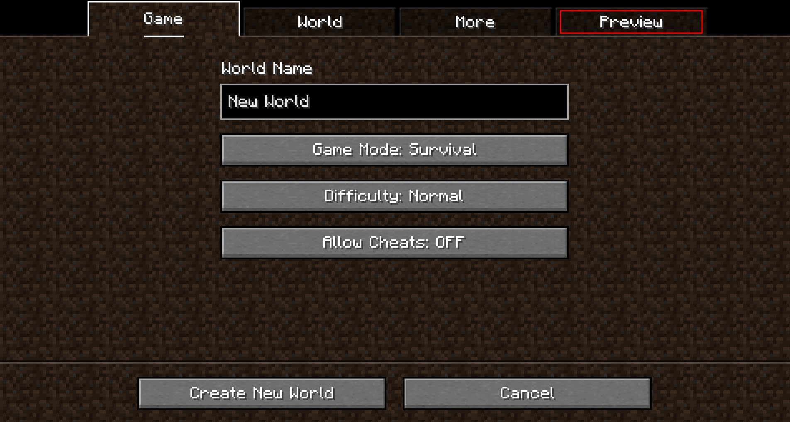
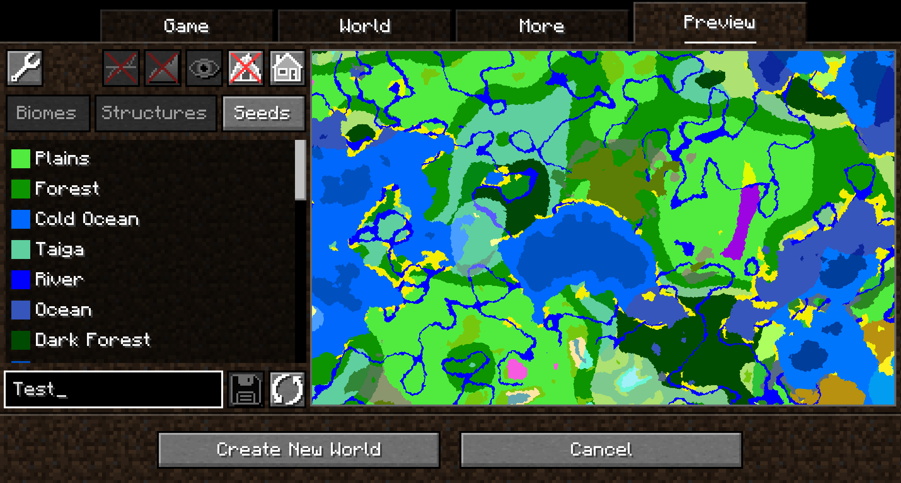
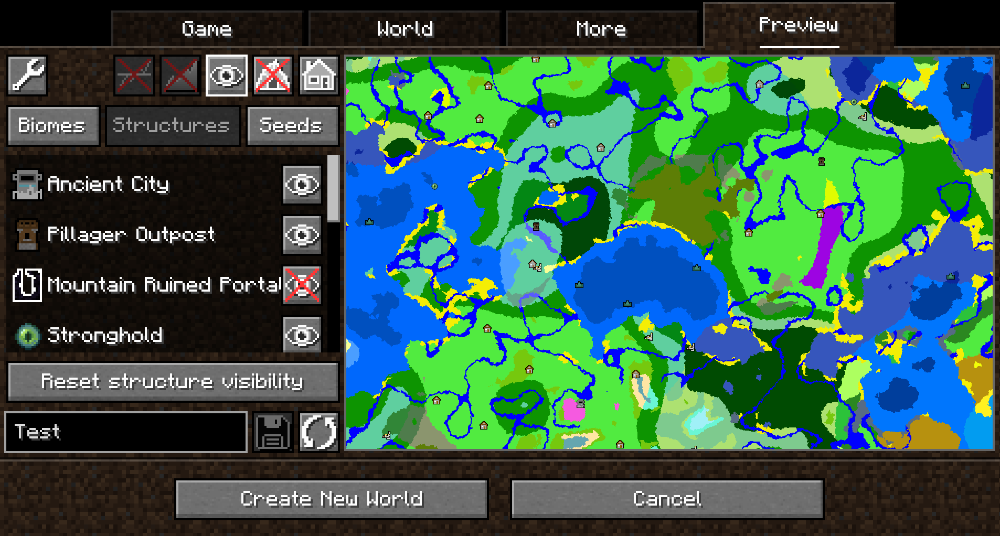
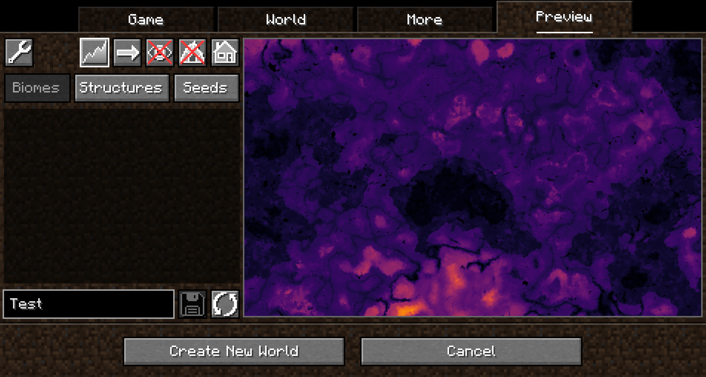

# World Preview

*World Preview* is a mod for visualizing Minecraft world seeds before they are generated.

Find us on [modrinth](https://modrinth.com/mod/world-preview/) and [CurseForge](https://www.curseforge.com/minecraft/mc-mods/world-preview)!

## Installation

Just download the latest *World Preview* JAR file for your ***exact*** Minecraft version.
Additionally, ***always*** ensure that you are using the correct version for your modloader (Fabric/Forge).
Then save the downloaded jar to the `mods` folder of your Minecraft instance.

Finally, if you are on Fabric you also need to download the
[Fabric API](https://modrinth.com/mod/fabric-api).

## Usage

*World Preview* adds a new `Preview` tab to the Singleplayer menu.

Upon opening that tab, a random seed is selected and a map of biomes is generated:

By default, the overworld dimension will be generated, structures will not be shown and no heightmap will be generated.
This can be changed in the Settings (top-left button in the `Preview` tab).

When structure sampling is enabled, the visibility of individual types of structures on the preview can be toggled:

When height sampling is enabled, the preview can be toggled between the biome map and a colorized heightmap:

##### Moving on the preview

Clicking and dragging on the map-part of the preview tab will move along the x and z axis.
This will cause the following load sequence:
- Any biomes that are not yet sampled on the current y-level
- Structures (if enabled)
- Height map (if enabled)
- Adjacent y-layers (if enabled)

Scrolling does **not** zoom into the map (there is a separate setting in the configuration menu for controlling the zoom level), but instead travels along the y-axis.
This allows cave biomes to be seen as well. Please note that non-cave biomes span the entire world height beyond that.

##### Other features

- Works with mods! Tested with:
  - Terralith
  - Biomes O' Plenty
- Persistent seed storage
- Highlighting specific biomes
- Highly configurable and extendable

## Supported version

This table shows the current support status for the Minecraft version.

| Minecraft Version | Status    |
|-------------------|-----------|
| `1.20.x`          | Supported |

## FAQ

**Q:** *Will Minecraft versions before 1.20 be supported?*

**A:** No.

---

**Q:** *Scrolling does not zoom the preview!*

**A:** Scrolling moves the y-level up and down. To change the zoom level, go to `Settings (top left wrench) -> Resolution` and change the visual size of a chunk.

---

**Q:** *My CPU is at 100%!*

**A:** You can limit the number of used cores in `Settings (top left wrench) -> General`. By default, *World Preview* tries to compute the biome preview / structures / heightmap as quickly as possible. These calculations require a lot of CPU power.

## Mod incompatibilities

This mod should be compatible with most mods (including those adding new biomes and dimensions).

## Adding support for new biomes and structures

New biomes, structures, and more can be registered via the Minecraft datapack mechanism. See [the World Preview dataformat docs](/DataFormats.md) for more information.
